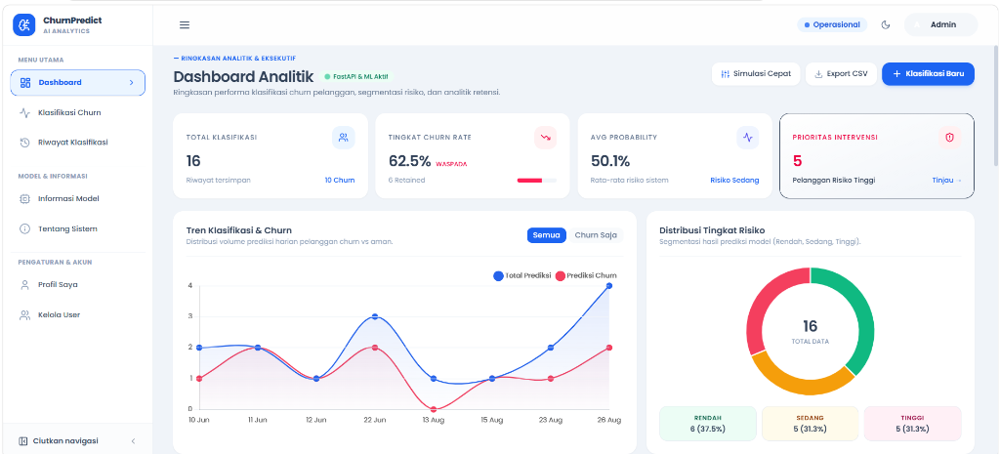
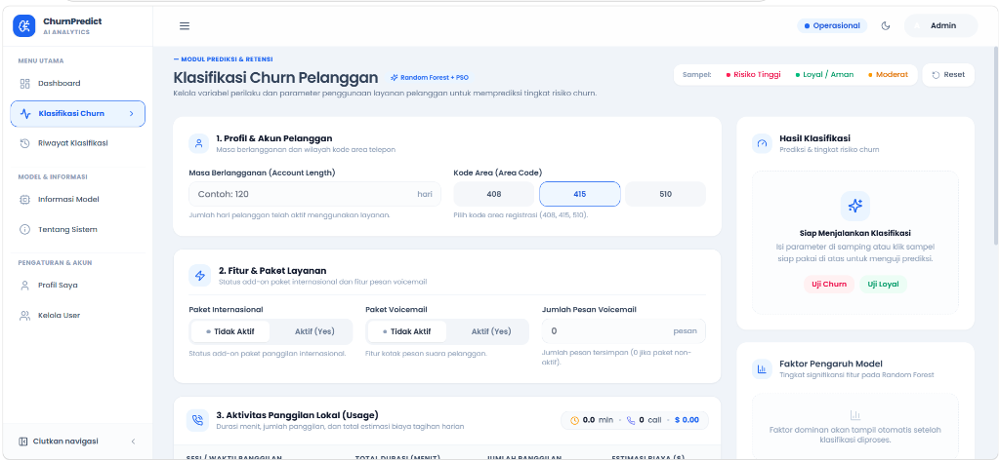
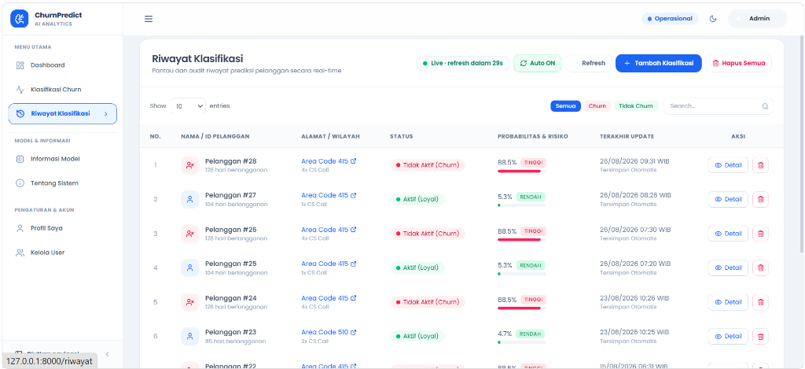

# 📊 Sistem Klasifikasi Churn Pelanggan (Customer Churn Classification)

> **Platform AI & Machine Learning Berbasis Random Forest dan Particle Swarm Optimization (PSO) untuk Prediksi serta Retensi Pelanggan Telekomunikasi.**

---

## 🌟 Tentang Sistem

**Sistem Klasifikasi Churn Pelanggan** adalah aplikasi web analitik cerdas yang mengintegrasikan frontend modern (**Laravel 11**) dengan microservice machine learning (**FastAPI Python**). 

Sistem ini dirancang untuk membantu penyedia layanan telekomunikasi dan tim bisnis mendeteksi sedini mungkin pelanggan yang berpotensi berhenti berlangganan (*churn*), mengidentifikasi faktor penyebab utama, serta memberikan rekomendasi aksi retensi yang tepat sasaran.

---

## 📸 Antarmuka Pengguna (UI Preview)

### 1. Halaman Beranda (Landing Page)
Halaman awal yang modern dan informatif dengan navigasi halus, ringkasan fitur utama, alur kerja sistem, dan manfaat retensi pelanggan.


---

### 2. Dashboard Analitik & Eksekutif
Pusat pemantauan metrik retensi secara real-time:
- **Statistik Kunci**: Total klasifikasi, tingkat *churn rate*, rata-rata probabilitas, dan prioritas intervensi.
- **Visualisasi Interaktif**: Grafik tren klasifikasi harian dan diagram donat segmentasi risiko (*Rendah, Sedang, Tinggi*).
- **Simulasi Cepat (*What-If Calculator*)**: Pengujian skenario parameter panggilan secara langsung tanpa input form penuh.



---

### 3. Modul Form Klasifikasi Churn
Formulir input data pelanggan berbasis 18 variabel telekomunikasi yang dilengkapi tombol sampel cepat (*Risiko Tinggi, Loyal/Aman, Moderat*):
- Menampilkan hasil prediksi instan: status klasifikasi, persentase probabilitas churn, level risiko, serta faktor dominan penentu keputusan model.



---

### 4. Riwayat Klasifikasi & Ekspor Data
Manajemen arsip data hasil prediksi pelanggan terpusat:
- Dilengkapi fitur pencarian cepat, filter status (*Semua, Churn, Tidak Churn*), rincian detail per pelanggan, serta tombol **Ekspor CSV** untuk pembuatan laporan.



---

## 🚀 Fitur Utama

- 🧠 **Model Machine Learning Akurat**: Menggunakan algoritma *Random Forest Classifier* yang dioptimasi menggunakan *Particle Swarm Optimization (PSO)* untuk penentuan rasio kelas optimal.
- ⚡ **Microservice FastAPI Real-time**: Eksekusi inferensi model berkecepatan tinggi dengan respons waktu hitungan milidetik.
- 🎨 **Desain Modern & Responsif**: Dibangun dengan estetika biru-slate yang elegan, tipografi **Poppins**, serta tata letak ramah pengguna (*user-friendly*).
- 🛡️ **Keamanan Berlapis (*Security Hardening*)**: Dilengkapi *Rate Limiting / Throttle* pada form autentikasi & prediksi, *HTTP Security Headers* (anti-clickjacking & XSS), serta sanitasi upload foto profil.
- 📥 **Ekspor Laporan**: Fitur unduh ringkasan data klasifikasi dalam format CSV untuk kebutuhan audit dan presentasi.

---

## 📋 18 Variabel Parameter Layanan

Sistem mengolah 18 variabel karakteristik pelanggan telekomunikasi yang dikelompokkan ke dalam beberapa kategori:

| Kategori | Parameter | Keterangan |
|---|---|---|
| **Profil Akun** | `account_length` | Lama masa berlangganan pelanggan (hari) |
| | `area_code` | Kode area telepon (408, 415, 510) |
| **Paket Layanan** | `international_plan` | Status add-on paket panggilan internasional (Aktif/Tidak) |
| | `voice_mail_plan` | Status fitur kotak pesan suara (Aktif/Tidak) |
| | `number_vmail_messages` | Jumlah pesan voicemail yang tersimpan |
| **Aktivitas Siang** | `total_day_minutes` | Total durasi panggilan siang hari (menit) |
| | `total_day_calls` | Jumlah frekuensi panggilan siang |
| | `total_day_charge` | Estimasi biaya tagihan panggilan siang ($) |
| **Aktivitas Sore** | `total_eve_minutes` | Total durasi panggilan sore/malam hari (menit) |
| | `total_eve_calls` | Jumlah frekuensi panggilan sore |
| | `total_eve_charge` | Estimasi biaya tagihan panggilan sore ($) |
| **Aktivitas Malam** | `total_night_minutes` | Total durasi panggilan larut malam (menit) |
| | `total_night_calls` | Jumlah frekuensi panggilan larut malam |
| | `total_night_charge` | Estimasi biaya tagihan panggilan larut malam ($) |
| **Internasional** | `total_intl_minutes` | Total durasi panggilan internasional (menit) |
| | `total_intl_calls` | Jumlah frekuensi panggilan internasional |
| | `total_intl_charge` | Estimasi biaya tagihan panggilan internasional ($) |
| **Dukungan Layanan**| `customer_service_calls`| Jumlah panggilan keluhan ke Customer Service |

---

## 🛠️ Arsitektur Teknologi

```
┌────────────────────────────────────────────────────────┐
│                   Web Browser (Client)                 │
└───────────────────────────┬────────────────────────────┘
                            │ HTTP / REST
┌───────────────────────────▼────────────────────────────┐
│              Frontend Web Server (Laravel 11)          │
│   - Blade Templates + Tailwind CSS + Alpine.js         │
│   - SQLite Local Database (Auth & History)             │
│   - HTTP Security Headers & Rate Limiting              │
└───────────────────────────┬────────────────────────────┘
                            │ JSON API Request (:5001)
┌───────────────────────────▼────────────────────────────┐
│            Microservice ML Engine (FastAPI Python)     │
│   - Random Forest + PSO Optimized Model                │
│   - Feature Scaler & Preprocessor                      │
│   - Probability & Risk Severity Calculator             │
└────────────────────────────────────────────────────────┘
```

---

## 💻 Panduan Menjalankan Sistem

### Persyaratan Sistem:
- **PHP** >= 8.2 & **Composer**
- **Python** >= 3.10
- **Node.js** >= 18.x *(opsional untuk development frontend)*

### Menjalankan Otomatis (Windows):
Cukup jalankan script launcher di root direktori proyek:
```cmd
.\start-system.bat
```
Script akan secara otomatis:
1. Menjalankan microservice FastAPI di port `5001`.
2. Menjalankan web server Laravel di port `8000`.
3. Membuka browser pada alamat `http://127.0.0.1:8000`.

### Menghentikan Sistem:
```cmd
.\stop-system.bat
```

---
